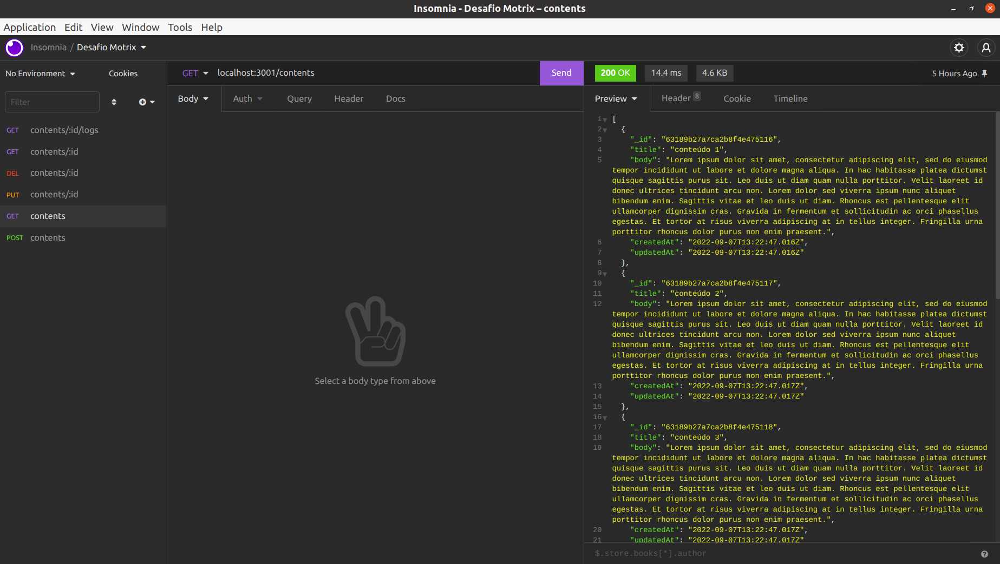

# Desafio Motrix

O desafio proposto foi o desenvolvimento de uma ferramenta simples para gestão de conteúdos
utilizando Node.js e React.

Como requisitos principais, temos:
- Criar, editar, listar, visualizar e apagar conteúdos;
- Visualizar o histórico de modificações de cada conteúdo;



# Tecnologias usadas

* Node.js
* Express
* Typescript
* Mongoose
* Joi
* Mocha
* Chai
* Sinon

<br>

# Rodando o projeto

  1. Clone o repositório:
  ```
  git clone git@github.com:riquelmebandeira/desafio-motrix-back.git
  cd desafio-motrix-back
  ```

  2. Instale as dependências:
  ```
  npm install
  ```

  3. É necessário o MongoDB para a execução plena da aplicação, caso não o tenha localmente instalado, poderá obtê-lo através do Docker com o comando:
  ```
  docker run --name mongodb -d -p 27017:27017 mongo:4.4.14
  ```

  4. Rode a aplicação com o comando:
  ```
  npm start
  ```

  5. Opcionalmente, você pode popular o banco de dados com alguns conteúdos pré-programados:
  ```
  npm run db:seed
  ```

  <br>

  # Testando a aplicação

  Para rodar os testes de integração da API, execute:
  ```
  npm test
  ```